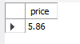

## Database  - Steam
- [Questions](#ancoraQuestion)
  
- [DER](#ancoraDER)

- [Team](#ancoraTeam)

- [Task](#ancoraTask)

- [Documentation](#ancoraDoc)
  
***

***

 ## Questions and Solution
<a id="ancoraQuestion"></a>


<details open>

##### What is the most released genre per year?**
```
    SELECT DISTINCT genres, Year(release_date), COUNT(genres)
    FROM `steam  - steam2014_2016_complete`
    WHERE  release_date = 2016
    GROUP BY genres 
    ORDER BY COUNT(genres) desc 
 ```
 ###### Result Return
 
 ###### Graphics

 ***
 
##### **How are the games ranked by playtime?**

```
    SELECT DISTINCT name, average_playtime 
    FROM `steam  - steam2014_2016_complete`
    WHERE  average_playtime  between 300 and 1000
    ORDER BY average_playtime desc
 ```
  ###### Result Return
 
 ###### Graphics

 
##### **How are games divided by age restrictions?**

```
    SELECT required_age, COUNT(name) 
    FROM streamdb.`steam  - steam2014_2016_complete`
    GROUP BY required_age
 ```
 ###### Result Return
 
 ###### Graphics

 ##### **Which developers have more achievements?**

```
    SELECT count(achievements), developer 
    FROM streamdb.`steam  - steam2014_2016_complete`
    GROUP BY achievements 
    ORDER BY achievements
    LIMIT 10
 ```
 
 ###### Result Return

 ###### Graphics
 

  ##### **How are the positive reviews according to game prices??**

```
    SELECT name, price, sum(positive_ratings) 
    FROM streamdb.`steam  - steam2014_2016_complete`
    GROUP BY positive_ratings
    LIMIT 10

 ```
 ###### Result Return
 
 ###### Graphics
 

 ##### **What is the average price of the games ?**

```
   SELECT FORMAT(AVG(price),2) 
   FROM streamdb.`steam  - steam2014_2016_complete` ;

 ```
 ###### Result Return
 
 ###### Graphics
  
 
</details>

***


### DER
<a id="ancoraDER"></a>
 


***
### Task
<a id="ancoraTask"></a>
/*:white_check_mark:*/ :x:


 | Questions           | Carol              | Isadora | Lorrane            | Thais | Wenderson          |
 | ------------------- | ------------------ | ------- | ------------------ | ----- | ------------------ |
 | `Create questions`  | :white_check_mark: | :x:     | :white_check_mark: | :x:   | :white_check_mark: |
 | ` Create Query `    | :white_check_mark: | :x:     | :white_check_mark: | :x:   | :white_check_mark: |
 | `Presentation Soft` | :white_check_mark: | :x:     | :x:                | :x:   | :x:                |
 | `Presentation Tech` | :x:                | :x:     | :x:                | :x:   | :x:                |
 | `Model Markdown`    | :x:                | :x:     | :x:                | :x:   | :white_check_mark: |
 | ` Conflict Git `    | :x:                | :x:     | :x:                | :x:   | :white_check_mark: |
 | ` Graphics `        | :white_check_mark: | :x:     | :x:                | :x:   | :white_check_mark: |

***
### Documentacion
<a id="ancoraDoc"></a>
- [Mysql](https://dev.mysql.com/doc/)
- [Steam](https://store.steampowered.com/)

***
### Team :
<a id="ancoraTeam"></a>

- ***Carolina Santos Marcello*** ( Colaboradora)
- ***Isadora Xavier R Silva*** ( Colaboradora)
- ***Thais Cristina da Silva Viviurka***(Gestão de gente)
- ***Lorrane Rocha da Silva*** (Co-facilitadora)
- ***Wenderson Patrick*** (Gestor de conhecimento)
